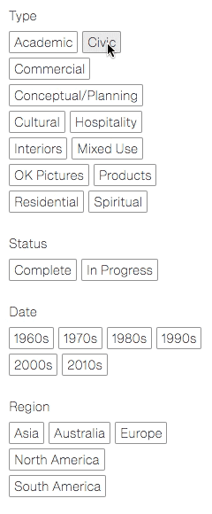
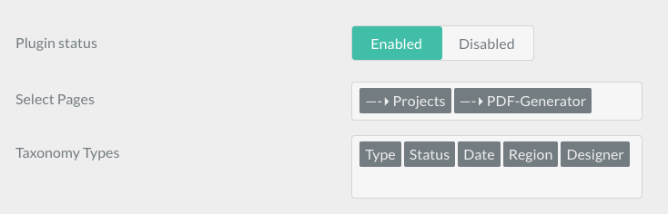

# Cascade Filters Plugin

The **Cascade Filters** Plugin is for [Grav CMS](http://github.com/getgrav/grav). Cascadefilters is a Grav plugin that generates a multiple layer filters collected throughout the site. main features includes: 
* Selectable taxonomy types; 
* Links have 3 states: normal, active, disabled ( the plugin will loops the child items's taxomomies to check if a link will continue to work or not, in another words, the filters are associated; 
* Generally, the plugin provides a pages selector to let you choice where to place the filters on, but it not designed for a site-wide usage. However, you can fork it as you wish.



## Installation

Installing the Cascade Filters plugin can be done in one of two ways. The GPM (Grav Package Manager) installation method enables you to quickly and easily install the plugin with a simple terminal command, while the manual method enables you to do so via a zip file.

### GPM Installation (Preferred)

The simplest way to install this plugin is via the [Grav Package Manager (GPM)](http://learn.getgrav.org/advanced/grav-gpm) through your system's terminal (also called the command line).  From the root of your Grav install type:

    bin/gpm install cascade-filters

This will install the Cascade Filters plugin into your `/user/plugins` directory within Grav. Its files can be found under `/your/site/grav/user/plugins/cascade-filters`.

### Manual Installation

To install this plugin, just download the zip version of this repository and unzip it under `/your/site/grav/user/plugins`. Then, rename the folder to `cascade-filters`. You can find these files on [GitHub](https://github.com/elvis-cheng/grav-plugin-cascade-filters) or via [GetGrav.org](http://getgrav.org/downloads/plugins#extras).

You should now have all the plugin files under

    /your/site/grav/user/plugins/cascade-filters
	
> NOTE: This plugin is a modular component for Grav which requires [Grav](http://github.com/getgrav/grav) and the [Error](https://github.com/getgrav/grav-plugin-error) and [Problems](https://github.com/getgrav/grav-plugin-problems) to operate.

## Configuration



You can select the taxonomies which you want to display. Default, all taxonomies defined in the site configuration will be used. but this is only a data-default@ so don't forget to save it before use.

## Usage

In the template twig file where you want to place the Cascade Filters:

```twig

<div class="sidebar column is-narrow">
	 {# get texonomy list #}
	 {# get queries as Array #}
	<a href="{{ page.url }}" class="button">Clean all filters </a>
	
		
			<p>
				{{ key }}
			</p>
			<ul class="is-clearfix">
				
					<li style="float: left; margin: 5px">
						{{ f.genQueryUrl(queries|sort,key,tax, page.url, cascadeFilters) }}
					</li>
				
			</ul>
		
	
</div>
```
In the page of collection, you can filter the child items like this:
```twig


    

    

```

Then the rendered html should be work! you can click and filter the child items now.

## Credits

Part of code forked from [@rhukster's](https://github.com/rhukster) [grav-plugin-taxonomylist](https://github.com/aptly-io/grav-plugin-taxonomylist)

## To Do

- [ ] Maybe the UTF-8 strings need to be processed, haven't test now.
